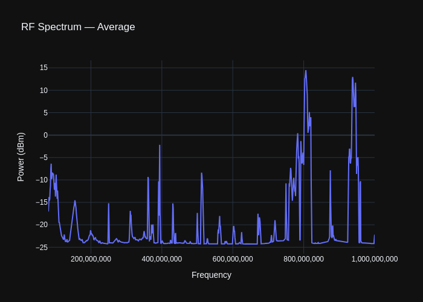
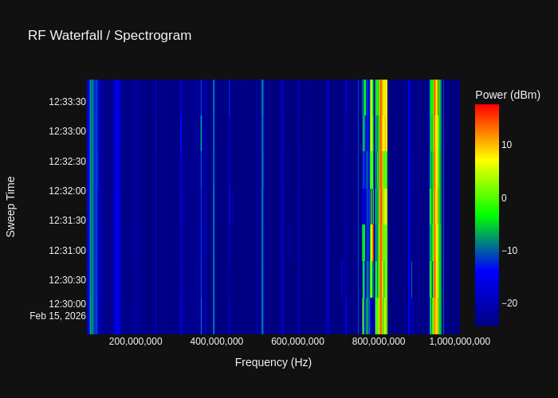
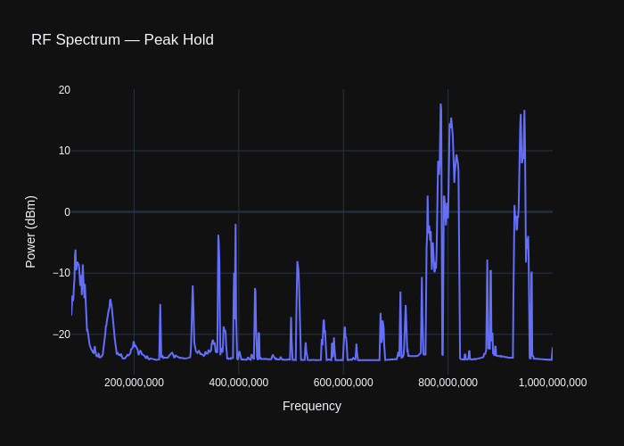
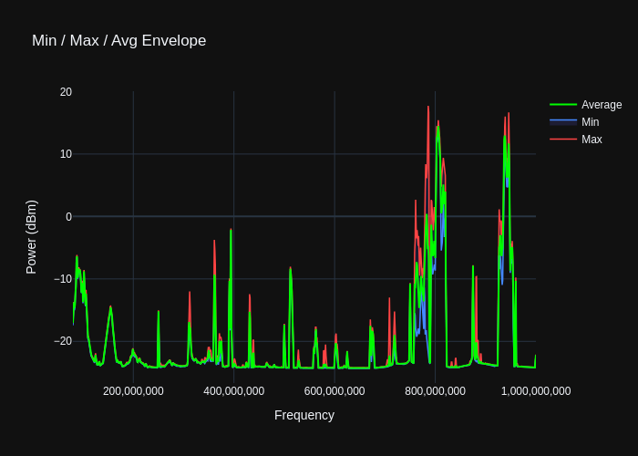
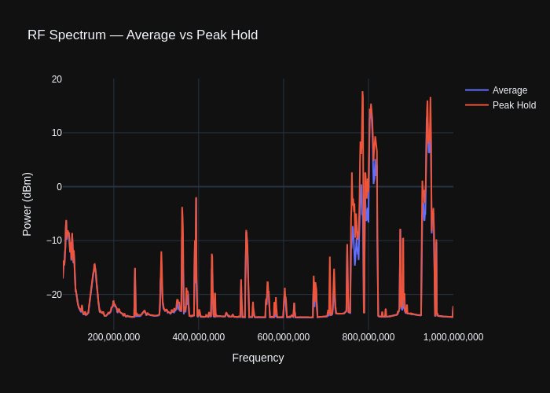

# rtl-spectrum

A modular Python library and CLI for spectral analysis of [rtl_power](http://kmkeen.com/rtl-power/) data.

Ported from the Java [rtlSpectrum](https://github.com/dernasherbrezon/rtlSpectrum) project.

## Features

- **Parse** rtl_power CSV output into structured data with automatic multi-bin expansion and frequency averaging
- **Sweep-aware parsing** — group CSV rows into individual sweeps by timestamp boundary for time-domain analysis
- **Plot** interactive Plotly spectrum charts with multi-series overlay, formatted axes, and HTML/PNG export
- **Waterfall / spectrogram** — 2-D heatmap (frequency × time × power) with a fixed SDR-style colorscale
- **Peak hold** — per-frequency maximum across all sweeps, highlighting the strongest signals over time
- **Min / Max / Avg envelope** — shaded band showing the spread of power at each frequency plus the mean trace
- **Subtract** a baseline/noise-floor scan from a signal to isolate real transmissions
- **Run** rtl_power directly from Python with configurable scan parameters
- **Save** processed data back to rtl_power-compatible CSV format
- **Band annotation** — load a frequency allocation YAML table and see band/sub-band usage info on hover in interactive plots
- **CLI** for all operations via `rtl-spectrum` command with `--mode` selection

## Gallery

All plots below were generated from a single rtl_power scan file (80 MHz – 1 GHz, 7 sweeps).

### Averaged Spectrum

The default mode — all sweeps are merged and overlapping frequencies are averaged.



### Waterfall / Spectrogram

A 2-D heatmap where the x-axis is frequency, the y-axis is sweep index (time) and colour represents power in dBm. Uses a fixed SDR-style colorscale (navy → blue → green → yellow → red).



### Peak Hold

Per-frequency maximum across all sweeps — useful for spotting the strongest signal that appeared at each frequency during the observation window.



### Min / Max / Avg Envelope

A shaded band between the per-frequency minimum and maximum, with a green line showing the average. Reveals how stable or bursty each frequency is.



### Multi-Series Overlay

Multiple analysis results plotted on the same chart for comparison (here: average vs. peak hold).



## Installation

```bash
# From the project directory
pip install -e .

# With development/test dependencies
pip install -e ".[dev]"
```

### Requirements

- Python ≥ 3.6
- [rtl_power](http://kmkeen.com/rtl-power/) (only required for live scans via the `run` command)

## Quick Start

### CLI

```bash
# Load a CSV and display an interactive spectrum plot (default: average mode)
rtl-spectrum load scan.csv

# Save plot to file instead of opening a browser
rtl-spectrum load scan.csv --output spectrum.html --no-show

# Waterfall / spectrogram
rtl-spectrum load scan.csv --mode waterfall

# Peak hold
rtl-spectrum load scan.csv --mode peak --output peak.png

# Min/Max/Avg envelope
rtl-spectrum load scan.csv --mode envelope

# Annotate hover with frequency band allocations (optional — disabled by default)
rtl-spectrum load scan.csv --bands /path/to/allocations.yaml
rtl-spectrum load scan.csv --mode waterfall --bands /path/to/allocations.yaml

# Subtract baseline from signal
rtl-spectrum subtract --signal scan.csv --baseline noise.csv

# Save subtracted result to CSV
rtl-spectrum subtract -s scan.csv -b noise.csv --output result.csv

# Plot multiple CSV files overlaid (average mode)
rtl-spectrum plot scan1.csv scan2.csv --title "Comparison"

# Plot a single file in waterfall mode
rtl-spectrum plot scan.csv --mode waterfall --output waterfall.html

# Re-export a CSV (normalises to 7-column format)
rtl-spectrum save --input raw.csv --output clean.csv

# Run a live rtl_power scan (requires RTL-SDR hardware)
rtl-spectrum run --freq-start 88000000 --freq-end 108000000 --step 100000
```

### Python API

```python
from rtl_spectrum.io import load_csv, load_csv_sweeps, save_csv
from rtl_spectrum.analysis import subtract, peak_hold, envelope
from rtl_spectrum.plotting import plot_spectrum, plot_waterfall, plot_envelope

# --- Basic: load & plot averaged spectrum ---
signal = load_csv("scan.csv")
plot_spectrum(
    datasets=[("Signal", signal)],
    title="My Scan",
    output="spectrum.html",
)

# --- Sweep-aware analysis ---
sweeps = load_csv_sweeps("scan.csv")

# Waterfall / spectrogram
plot_waterfall(sweeps, title="Waterfall", output="waterfall.png")

# Peak hold
peak = peak_hold(sweeps)
plot_spectrum(
    datasets=[("Peak Hold", peak)],
    title="Peak Hold",
    output="peak.html",
)

# Envelope (min, max, avg)
min_s, max_s, avg_s = envelope(sweeps)
plot_envelope(min_s, max_s, avg_s, title="Envelope", output="envelope.png")

# --- Band annotations (interactive hover, optional) ---
from rtl_spectrum.bands import load_bands

bands = load_bands("/path/to/allocation.yaml")  # see resources/default.yaml for format
plot_spectrum(
    datasets=[("Signal", signal)],
    title="Annotated Spectrum",
    bands=bands,  # hover shows band/sub-band info
)

# --- Subtraction ---
baseline = load_csv("noise.csv")
result = subtract(signal, baseline)
save_csv(result, "result.csv")
```

## Project Structure

```
rtl-spectrum-py/
├── pyproject.toml
├── README.md
├── .github/
│   └── workflows/
│       └── ci.yml             # GitHub Actions CI
├── docs/
│   └── images/                # Generated plot images
├── resources/
│   ├── README.md                  # Format docs for allocation YAML files
│   ├── default.yaml               # Sample frequency allocation (format demo)
│   └── Finnish_frequency_allocation_table.yaml
├── src/
│   └── rtl_spectrum/
│       ├── __init__.py        # Package version
│       ├── models.py          # BinData dataclass
│       ├── parser.py          # BinDataParser + SweepParser
│       ├── io.py              # load_csv / load_csv_sweeps / save_csv
│       ├── runner.py          # rtl_power subprocess wrapper
│       ├── analysis.py        # subtract, peak_hold, envelope
│       ├── bands.py           # Frequency band allocation lookup
│       ├── formatters.py      # Human-readable frequency/power formatting
│       ├── plotting.py        # plot_spectrum, plot_waterfall, plot_envelope
│       ├── progress.py        # Progress reporting
│       └── cli.py             # Click CLI entry point
└── tests/
    ├── conftest.py            # Shared fixtures
    ├── resources/             # Test CSV files
    ├── test_parser.py         # Parser unit tests
    ├── test_formatters.py     # Formatter unit tests
    ├── test_analysis.py       # Subtraction tests
    ├── test_io.py             # I/O round-trip tests
    ├── test_validation.py     # End-to-end validation
    ├── test_sweep_parser.py   # SweepParser & load_csv_sweeps tests
    ├── test_time_analysis.py  # peak_hold, envelope, waterfall, envelope plot tests
    └── test_bands.py          # Band annotation tests
```

## Modules

### `models.BinData`

Dataclass representing a single frequency bin — the fundamental data unit. Stores original CSV string fields for round-trip fidelity alongside computed numeric values (`frequency_start_parsed`, `dbm_average`).

### `parser.BinDataParser`

Parses rtl_power CSV rows. Each row may contain multiple dBm sub-bins (columns 6+), which are expanded into individual `BinData` entries at `freq_start + i × step`. Overlapping frequency keys across rows are averaged automatically. NaN values are skipped.

### `parser.SweepParser`

Groups CSV rows into individual sweeps by detecting changes in the `date + time` columns. Each sweep is returned as a `(timestamp, List[BinData])` tuple, preserving temporal order. Within a sweep, overlapping frequency bins are merged by averaging.

### `io`

- `load_csv(path)` — Read an rtl_power CSV file and return a sorted, averaged list of `BinData` (all sweeps merged).
- `load_csv_sweeps(path)` — Read an rtl_power CSV file and return a list of per-sweep `(timestamp, List[BinData])` tuples, preserving temporal order.
- `save_csv(data, path)` — Write `BinData` list to a 7-column CSV compatible with rtl_power format.

### `analysis`

- `subtract(signal, baseline)` — Per-frequency-bin subtraction (signal − baseline) in dBm. Matches by exact `frequency_start` string.
- `subtract_multi(signals, baseline)` — Apply subtraction to multiple signal series.
- `peak_hold(sweeps)` — Return a single `List[BinData]` containing the maximum dBm value observed at each frequency across all sweeps. Frequencies that appear in only some sweeps are still included (skip-missing strategy).
- `envelope(sweeps)` — Return `(min_series, max_series, avg_series)`, each a `List[BinData]` sorted by frequency. For every frequency present in any sweep, the minimum, maximum, and average power values are computed across the sweeps where that frequency appears.

### `runner`

- `run_rtl_power(...)` — Execute `rtl_power` as a subprocess with configurable parameters and return parsed `BinData`.

| Parameter     | Default      | Description                    |
|---------------|--------------|--------------------------------|
| `freq_start`  | 24 MHz       | Start frequency in Hz          |
| `freq_end`    | 1.7 GHz      | End frequency in Hz            |
| `step`        | 1 MHz        | Frequency step in Hz           |
| `integration` | 120 s        | Integration time in seconds    |
| `gain`        | 0 (auto)     | Gain in dB                     |
| `crop`        | 20%          | Edge crop percentage           |

### `formatters`

- `format_frequency(hz)` — Convert Hz to human-readable string (e.g. `"98.1 MHz"`).
- `format_power(dbm)` — Format dBm value to 2 decimal places (e.g. `"-23.45 dBm"`).

### `plotting`

- `plot_spectrum(datasets, ..., bands=None)` — Create interactive Plotly line charts with dark theme, crosshair hover, and optional HTML/PNG export. Supports multi-series overlay. When `bands` is provided, hover tooltips include frequency allocation info.
- `plot_waterfall(sweeps, ..., bands=None)` — Render a 2-D spectrogram heatmap (frequency × sweep × power) using the fixed `SDR_COLORSCALE` (navy → blue → green → yellow → red). Supports HTML/PNG export.
- `plot_envelope(min_series, max_series, avg_series, ..., bands=None)` — Plot a filled band between min and max with a green average trace. Supports HTML/PNG export.
- `SDR_COLORSCALE` — Module-level constant defining the fixed SDR-style colorscale used by `plot_waterfall`.

### `bands`

- `load_bands(path)` — Load a frequency allocation YAML file and return a `BandTable` for fast lookup. Validates the YAML structure before processing (raises `ValueError` for malformed files). All YAML frequencies are expected in **kHz** and are converted to Hz internally.
- `validate_bands_yaml(data)` — Validate that parsed YAML data conforms to the expected band allocation format. Inspects the first few entries for required fields (`primary_service_category`, `primary_frequency_range`, `subbands`). Raises `ValueError` with a descriptive message on mismatch.
- `lookup_band(freq_hz, table)` — Find the narrowest band/sub-band containing the given frequency. Returns a `BandInfo` with `start_hz`, `end_hz`, `width_khz`, `usage`, and `primary_service`, or `None` if no band matches.
- `format_band_hover(info)` — Format a `BandInfo` as a compact HTML snippet for Plotly tooltips (shows service category, frequency range, and sub-band usage).

## CLI Reference

```
rtl-spectrum [OPTIONS] COMMAND [ARGS]...

Commands:
  load      Load an rtl_power CSV file and display spectrum plot
  plot      Plot one or more CSV files overlaid on the same chart
  run       Run rtl_power and display the captured spectrum
  save      Load a CSV and re-export in rtl_power format
  subtract  Subtract baseline from signal and display/save result
```

### Mode Selection (`--mode` / `-m`)

The `load` and `plot` commands accept a `--mode` option to select the analysis type:

| Mode        | Description                                                  |
|-------------|--------------------------------------------------------------|
| `average`   | Default. Merge all sweeps and average overlapping bins.      |
| `waterfall` | 2-D spectrogram heatmap (frequency × time × power).         |
| `peak`      | Per-frequency maximum across all sweeps.                     |
| `envelope`  | Min/max/avg envelope with shaded band and mean trace.        |

```bash
rtl-spectrum load scan.csv --mode waterfall
rtl-spectrum plot scan.csv -m envelope --output envelope.png --no-show
```

### Band Annotations (`--bands`)

The `load` and `plot` commands accept an optional `--bands` option pointing to the
full path of a frequency allocation YAML file.  When provided, hovering over any
frequency in an interactive (HTML) plot shows the matching band or sub-band
allocation.  When omitted, annotations are silently disabled.

```bash
rtl-spectrum load scan.csv --bands /path/to/allocations.yaml
rtl-spectrum load scan.csv --mode waterfall --bands /path/to/allocations.yaml
```

A sample `resources/default.yaml` is included in the repository as a format
reference.  See `resources/README.md` for documentation on creating your own
allocation file.

The tooltip displays:
- 📡 **Primary service** (e.g. *BROADCASTING*)
- **Frequency range** in human-readable units (e.g. *87.5 MHz – 108 MHz*)
- **Sub-band usage** (e.g. *FM Radio*) when the cursor is inside a sub-band

The YAML format expects frequencies in **kHz**.  See `resources/default.yaml`
for a format reference with inline documentation, and `resources/README.md`
for detailed field descriptions.

> **Note:** Band annotations only appear in interactive HTML plots.
> Static PNG exports are unaffected.

Run `rtl-spectrum COMMAND --help` for detailed options on each subcommand.

## Testing

```bash
# Run all tests (118 tests)
python -m pytest tests/ -v

# With coverage
python -m pytest tests/ --cov=rtl_spectrum --cov-report=term-missing
```

## CSV Format

The library reads and writes the standard rtl_power CSV format:

```
date, time, freq_start, freq_end, step, num_samples, dBm1[, dBm2, ...]
```

- **Columns 0–5**: Metadata (date, time, frequency range, step size, sample count)
- **Columns 6+**: Power measurements in dBm — each column represents a sub-bin at `freq_start + i × step`

A single CSV file typically contains multiple sweeps — the library detects sweep boundaries by changes in the `date + time` columns.

## License

Apache License 2.0 — see the original [rtlSpectrum](https://github.com/dernasherbrezon/rtlSpectrum) project.
